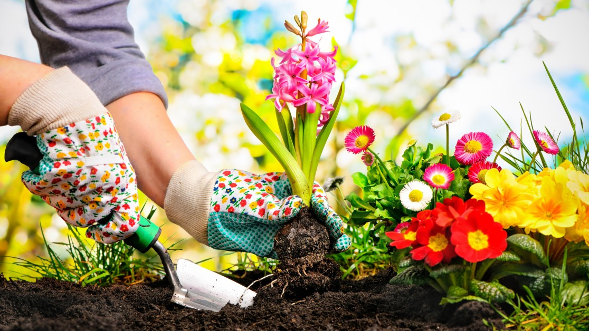

# Das Gebäudemanagement #1
<!--hi wie gehts-->
*Willkommen* auf _unserer_ **Seite**

TextTextTextTextTextTextTextTextTextTextTextTextTextTextText</br> TextTextTextTextTextTextTextTextTextTextTextTextTextTextText</br> 
TextTextTextTextTextTextTextTextTextTextTextTextTextTextText</br> 
TextTextTextTextTextTextTextTextTextTextTextTextTextTextText</br> 
TextTextTextTextTextTextTextTextTextTextTextTextTextTextText</br> 
TextTextTextTextTextTextTextTextTextTextTextTextTextTextText</br> 
<!-- hi
## Subheading
### Angebote

* Text
	* Text
		* Text
* Text
* Text
1. Text
2. Text

Mehr Informationen [hier](https://uswitch.github.io/codef-syllabus/lesson-2/markdown/) -->


TextTextTextTextTextTextTextTextTextTextTextTextTextTextText</br> TextTextTextTextTextTextTextTextTextTextTextTextTextTextText</br> 
TextTextTextTextTextTextTextTextTextTextTextTextTextTextText</br> 
TextTextTextTextTextTextTextTextTextTextTextTextTextTextText</br> 
TextTextTextTextTextTextTextTextTextTextTextTextTextTextText</br> 
TextTextTextTextTextTextTextTextTextTextTextTextTextTextText</br> 
<!-- > Fail = first attempt in learning

> Unknown

Good 
```
morning
```-->

<iframe width="560" height="315" src="https://www.youtube.com/embed/qyoWMOSLsYE" title="YouTube video player" frameborder="0" allow="accelerometer; autoplay; clipboard-write; encrypted-media; gyroscope; picture-in-picture" allowfullscreen></iframe>
<!-- <a href="/hi">Page </a> -->
<a href="/dienstleistungen/" style="color: blue">Dienstleistungen </a>&nbsp; <a href="/kontakt/" style="color: blue">Kontakt</a> &nbsp; <a href="/über-uns">Über uns</a>


